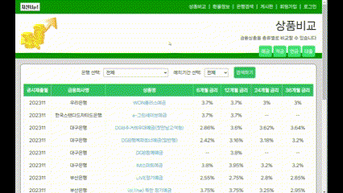
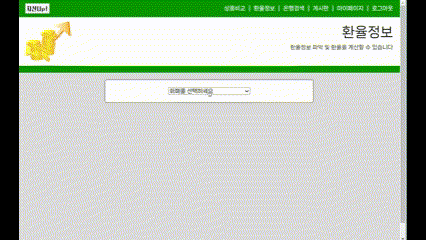
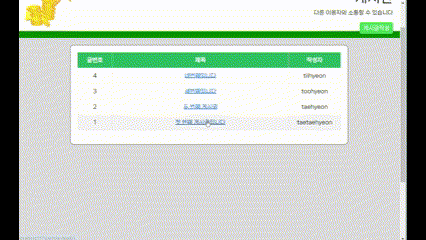
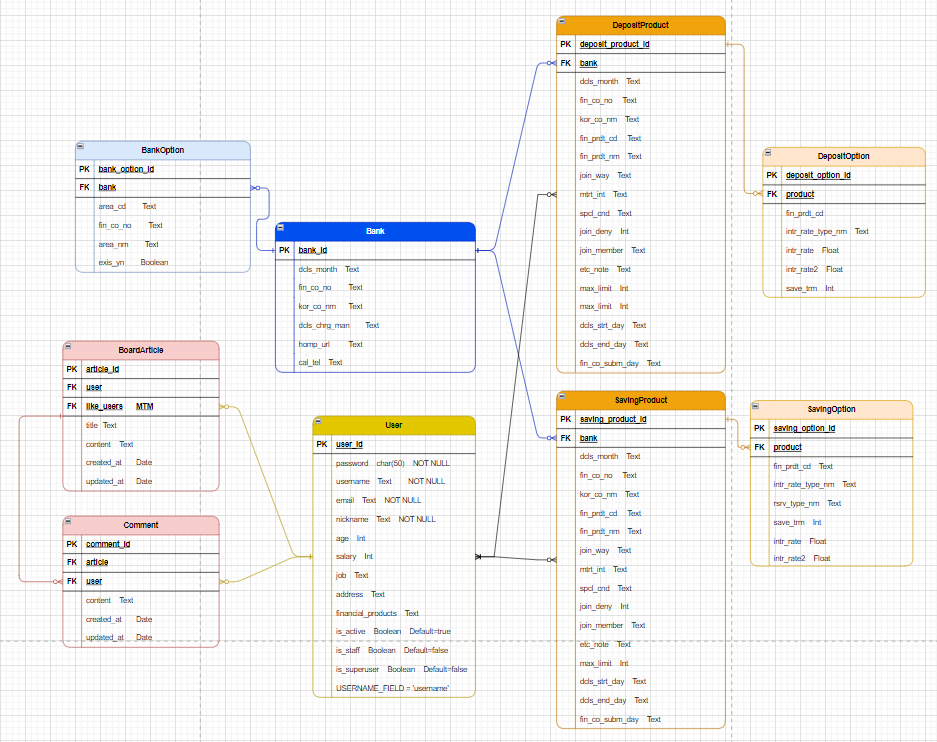

# 자산Up!

# 목차

1. [**서비스 소개**](#-자산Up!)
2. [**기획 배경**](#-기획-배경)
3. [**주요 기능**](#-주요-기능)
4. [**회고록**](#-회고록)
5. [**팀원 소개**](#-팀원-소개)
6. [**기술 스택**](#-기술-스택)
7. [**erd 다이어그램**](#-erd-다이어그램)
8. [**와이어프레임**](#-와이어프레임)

## I. 프로젝트 개요
- 금융 상품을 추천하는 알고리즘을 구성하여 웹 어플리케이션 구성하기
- 명세서의 요구에 맞춰 필수기능 구현 및 추가기능 만들기

### 메인(비로그인)

- 비로그인 상태의 메인화면
- 예/적금별 이용량 Top5 상품 확인 가능
- 상품 상세 확인 가능

### 메인(로그인)

- 로그인 상태의 메인화면
- 이용자의 연령/성별, MBTI별 Top3 상품 확인 가능
- 상품 상세 확인 및 가입 가능
- 가입한 상품별 금리 곡선 확인 가능

### 금융상품 비교

- 상품의 유형별로 금리를 비교하며 상품 확인 가능
- 상품 상세 확인 및 가입 가능

### 환율정보

- 환율 계산 가능

### 은행검색

- 사용자 주변의 은행 검색 가능
- 지역별로도 상품이 존재하는 은행 검색 가능

### 게시판

- 글 작성/수정/삭제 및 댓글 작성/수정/삭제 가능

### 상품추천

- 카테고리별로 나이, 성별, 연봉, MBTI이 같은 이용자들이 가입한 금융상품 안내
- 상품 상세 정보 확인 및 가입 가능

## II. 설계 내용

### ㄱ. 설계 내용

#### - ERD 관계도

- 금융상품 추천 알고리즘 구현하기 위해 유저와 금융상품 M:N 관계 형성

#### - 설계방식
1. 'Jira'를 통해 설계 계획(일정 관리)
2. 추천 알고리즘을 제외한 필수적 기능 구현
3. 추천 알고리즘 아이디어 구상 후 핵심 기능 구현

#### - 기술스택
- 프론트엔드: Vue.js
- 백엔드: django

## III. 금융 상품 추천 알고리즘 설명

### 유저와의 유사도를 이용한 알고리즘
- 유저 정보와 유사한 이용자들의 금융상품 추천 알고리즘
  - 카테고리: 나이, 성별, 연봉, MBTI
  - 알고리즘: 파이썬 함수를 통해 유저와 각 카테고리가 같은 이용자들이 가입한 상품을 유저모델의 finance_product 속성을 통해서 찾고 그 상품이 검색될 때마다 카운트할 변수를 생성하고 제일 높은 이용량 순서대로 추천(카테고리가 여러 개가되면 조건이 겹치도록 설정)

### 이용량을 이용한 알고리즘
- 유저가 아닌 비로그인 상태에서의 상품별 이용량 추천
  - 카테고리: 예금, 적금
  - 알고리즘: 전체 유저를 조회하고 유저모델의 finance_product 속성을 통해서 가입한 상품을 찾고 그 상품이 검색될 때마다 카운트할 변수를 생성하고 제일 높은 이용량 5개의 상품을 추천

## IV. 서비스 대표 기능들에 대한 설명
- 메인페이지
  - 로그인 상태
    - 자산게이지
      - 설명: 목표자산의 현재자산 비율
      - 알고리즘: 이용자가 가입한 상품의 금리를 이용해 유저모델의 updated_at 모델 속성을 통해 오늘날짜와 다르면 갱신후 현재자산에 납입금의 금리만큼 더하여 현재자산을 증가시킴
    - 유저의 나이&성별 Top3 상품, MBTI Top3 상품
  - 비로그인 상태
    - 예금 Top5 상품
    - 적금 Top5 상품
- 금융상품 비교
  - 금융감독원의 API를 사용한 데이터
  - 금융상품을 상품종류별로 금리기간에 따라 정보 출력
    - 각 정보의 정렬기능 사용 가능
    - 은행별, 금리별 검색 가능
- 금융상품 상세
  - 금융상품에 대한 상세정보 안내
    - 가입하기를 통해 납입금을 설정하여 자산게이지를 증가시킬 수 있음
    - 비로그인시에는 불가능
- 환율정보
  - 한국수출입은행의 API를 사용한 데이터
  - 환율정보 안내 및 환율 계산 기능
- 은행검색
  - 카카오맵의 API를 사용한 데이터
  - 기본 위치는 유저의 주소
  - 유저의 주소 근처 은행 검색가능
  - 지역별 주변 은행 검색 기능
  - 지역 선택 및 은행 선택시 선택지역의 선택은행 검색 가능
- 게시판
  - 게시글과 댓글 작성 및 수정, 삭제 가능
  - 게시글 좋아요 기능 구현
- 프로필
  - 가입상품
    - 가입상품 리스트 출력 및 상품별 금리를 그래프로 출력
  - 상품추천
    - 추천 알고리즘을 통해 카테고리별 나이, 성별, 연봉, MBTI이 같은 이용자들이 가입한 금융상품 안내
    - 포트폴리오를 통해 유저의 연봉을 계산하여 월납입금을 계산하고, 각 상품에 만기시 수령금액을 나타내게 함
  - 기본정보
    - 기본정보를 수정할 수 있음

## V. 느낀점

- 시간적인 제한이 있어 구현하고 싶은 기능들을 다 구현하지 못한 아쉬움이 있음
  - 필수적이고 핵심적인 기능을 우선 구현하고 부가적인 기능은 그 후로 작업의 우선순위를 선정하는 방식으로 프로젝트에 임하기
- 기본적인 틀을 중요시 여기지 않고 자세히 만들지 않으면 추가적인 오류가 발생하기 쉬움
  - 간단해 보이는 오류라도 잘 해결해놓고, 디버깅을 중요시 할 것
- 학습한 내용에 대해서 정확히 아는 것이 중요하다는 것을 느낌
  - 정확하게 아는 것이 아니라 애매하게 알고 있으면 오히려 디버깅시 더 많은 시간을 할애하게 됨
